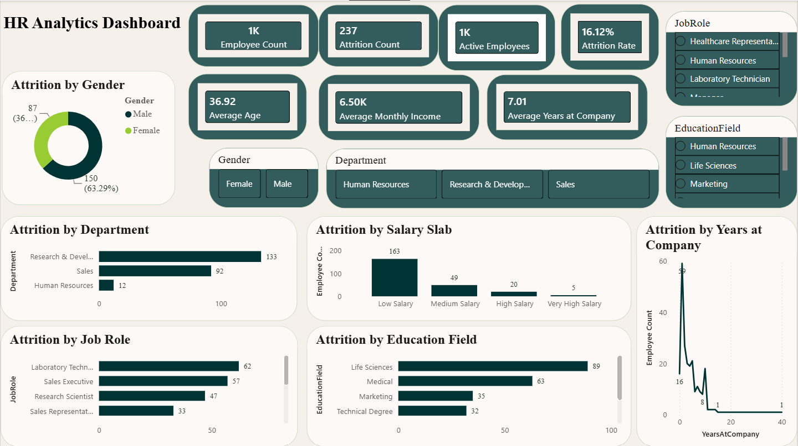

# 📊 HR Analytics Dashboard

An interactive HR Analytics Dashboard built using **Microsoft Power BI** to analyze employee attrition and workforce trends. This dashboard helps identify key factors influencing employee turnover and supports data-driven HR decision-making.

---

# 📷 Dashboard Preview



---

# 🎯 Project Objective

The objective of this project is to analyze employee attrition and uncover patterns related to:

- Employee turnover
- Department-wise attrition
- Job role analysis
- Salary slab analysis
- Education field analysis
- Gender distribution
- Years at company

---

# 🛠️ Tools & Technologies

- Microsoft Power BI
- Power Query
- DAX (Data Analysis Expressions)
- CSV Dataset

---

# 📂 Project Structure

```
HR-Analytics-Dashboard/
│
├── Dataset/
│   └── WA_Fn-UseC_-HR-Employee-Attrition.csv
│
├── Images/
│   └── dashboard.png
│
├── PowerBI/
│   └── Dashboard.pbix
│
├── README.md
├── LICENSE
└── .gitignore
```

---

# 📈 Key Performance Indicators (KPIs)

- 👥 Total Employees: **1470**
- 🚪 Attrition Count: **237**
- ✅ Active Employees: **1233**
- 📉 Attrition Rate: **16.12%**
- 🎂 Average Age: **36.92 Years**
- 💰 Average Monthly Income: **6.50K**
- 📅 Average Years at Company: **7.01 Years**

---

# 📊 Dashboard Features

- Employee Attrition Overview
- Attrition by Department
- Attrition by Job Role
- Attrition by Gender
- Attrition by Salary Slab
- Attrition by Education Field
- Attrition by Years at Company
- Interactive Slicers

---

# 💡 Key Insights

- Research & Development recorded the highest employee attrition.
- Employees in the **Low Salary** category had the highest attrition.
- Laboratory Technicians and Sales Executives experienced significant employee turnover.
- Most employees left during their early years at the company.
- Life Sciences had the highest attrition among education fields.
- Male employees accounted for a larger share of attrition than female employees.

---

# 🚀 How to Use

1. Clone the repository

```bash
git clone https://github.com/Cyanide07x/HR-Analytics-Dashboard.git
```

2. Open

```
PowerBI/Dashboard.pbix
```

3. Explore the dashboard using the interactive slicers.

---

# 📌 Skills Demonstrated

- Data Cleaning (Power Query)
- Data Modeling
- DAX Measures
- KPI Design
- Dashboard Design
- Business Intelligence
- Data Visualization

---

# 📬 Connect With Me

**Utsav**

- LinkedIn: https://www.linkedin.com/in/utsav-sachan-7759b4250/
- GitHub: https://github.com/Cyanide07x

---

⭐ If you found this project useful, consider giving it a star!
